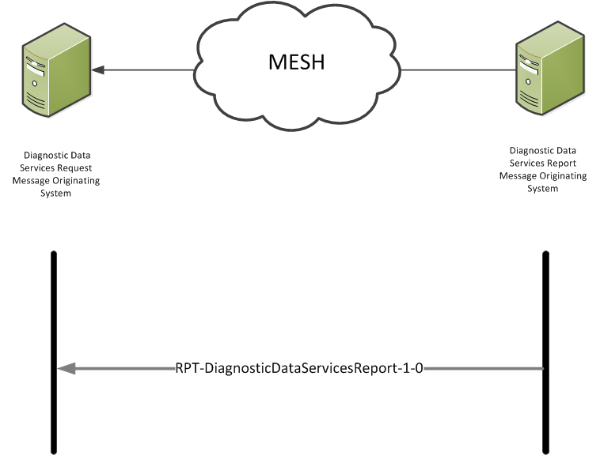

## FHIR Messaging Implementation and Architecture ##

**Diagnostic Data Services**

This section provides Diagnostic Data Services implementers with the information required to utilise the Diagnostic Data Services Domain Message Specification.

**Message Patterns and Message Structure**

The Diagnostic Data Services FHIR interface is based on the [HL7 FHIR DSTU2 1.0.1 Messaging Implementation] (Sept 2015) Messaging Implementation and supports one interaction. 

**Message acknowledgements and responses:**

Information to follow at a later date

**RPT-DiagnosticDataServicesReport-1-0 Interaction** 

The sender (Request Fulfiller) will construct a Diagnostic Data Services Report message and send it to the receiver (Request Placer) system.

- **Sender:** (Request Fulfiller):Diagnostic Data Services Report Message Originating System
- **Receiver:** (Request Placer):*Diagnostic Data Services Request Message Originating System
- **Message:** **Wire Format**: DiagnosticDataServicesReport-1-0

**Message acknowledgements and responses:**

Information to follow at a later date

**Diagnostic Data Services Interaction Diagram**
 

The diagram shows the Diagnostic Data Services Interactions:

 

  
 

**FHIR Messaging**

The FHIR message made up of the resources is bundled within an FHIR Bundle wrapper to create the FHIR structure.

For the purpose of this implementation guide, the FHIR resources are bundled together to construct a FHIR Message payload.

In FHIR messaging, a "message" is sent from a source application to a destination application when an event happens. Events mostly correspond to things that happen in the real world. The message consists of a bundle identified by the tag "http://hl7.org/fhir/tag/message", with the first resource in the bundle being a MessageHeader resource.

**XML Example of the wrapped FHIR message**

TBA

**Further Information**
  
For more information about FHIR messaging please visit: [HL7 FHIR DSTU2 1.0.1 Messaging Implementation]

[HL7 FHIR DSTU2 1.0.1 Messaging Implementation]:http://hl7.org/fhir/messaging.html

